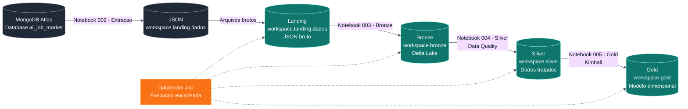

# Lakehouse com Databricks Free Edition e Arquitetura Medalhao

Projeto desenvolvido para a disciplina de Engenharia de Dados, com o objetivo de construir um pipeline Lakehouse no Databricks Free Edition utilizando a Arquitetura Medalhão.

O fluxo implementado parte de uma base não relacional no MongoDB Atlas criada a partir do arquivo `ai_job_market_insights.csv`, uma base sobre mercado de trabalho em IA. Cada coluna do arquivo original foi carregada como uma collection no MongoDB, mantendo todas as linhas por meio do campo `id_linha`. A primeira etapa do pipeline extrai todas as collections desse banco e grava arquivos JSON na Landing.

## Documentacao

- [Documentacao MkDocs publicada no GitHub Pages](https://omrl.github.io/trabalho-3-lakehouse-databricks/)

## Objetivo do Trabalho

Construir um pipeline de dados no Databricks seguindo as etapas:

1. Extrair dados de todas as collections de um banco não relacional.
2. Armazenar os arquivos brutos em JSON no schema `landing`, dentro do volume `dados`.
3. Ler os arquivos JSON da Landing e gravar tabelas Delta no schema `bronze`.
4. Ler a Bronze, aplicar tratamentos e regras de qualidade, e gravar no schema `silver`.
5. Ler a Silver e criar uma camada dimensional no schema `gold`, seguindo os conceitos de Ralph Kimball.
6. Encadear todos os notebooks em uma Job no Databricks.

## Arquitetura



## Base de Dados

A base original e o arquivo `ai_job_market_insights.csv`, armazenado em `data/raw/`. Ele possui 500 registros e 10 colunas sobre cargos, setores, salarios, localizacao, habilidades exigidas, nivel de adocao de IA, risco de automacao e projecao de crescimento.

Esse arquivo foi preparado para carga no MongoDB Atlas por meio dos arquivos JSON em `data/mongodb/collections/`. Cada coluna vira uma collection no banco `ai_job_market`. O notebook `002 - Extracao` le essas collections e gera os JSONs da Landing.

Cada documento JSON contem:

- `id_linha`: identificador da linha original;
- a coluna extraida da fonte original.

| Collection / Arquivo | Registros | Coluna original |
| --- | ---: | --- |
| `job_title` | 500 | `Job_Title` |
| `industry` | 500 | `Industry` |
| `company_size` | 500 | `Company_Size` |
| `location` | 500 | `Location` |
| `ai_adoption_level` | 500 | `AI_Adoption_Level` |
| `automation_risk` | 500 | `Automation_Risk` |
| `required_skills` | 500 | `Required_Skills` |
| `salary_usd` | 500 | `Salary_USD` |
| `remote_friendly` | 500 | `Remote_Friendly` |
| `job_growth_projection` | 500 | `Job_Growth_Projection` |

## Notebooks

Os notebooks estao em formato `.ipynb` na pasta `notebooks/`. Esse formato pode ser revisado diretamente pelo GitHub, aberto em Jupyter e importado no Databricks como notebook.

| Ordem | Notebook | Finalidade |
| ---: | --- | --- |
| 1 | `001 - Preparando ambiente` | Cria schemas e volume do projeto |
| 2 | `002 - Extracao` | Extrai collections do MongoDB Atlas para JSON na Landing |
| 3 | `003 - Bronze` | Le JSONs da Landing e cria tabelas Delta na Bronze |
| 4 | `004 - Silver` | Aplica tratamentos e Data Quality |
| 5 | `005 - Gold` | Cria dimensoes e fato no modelo dimensional |
| 6 | `006 - Destruindo ambiente` | Remove objetos criados, quando necessario |

## Execucao no Databricks

1. Acesse o Databricks Free Edition.
2. Importe os arquivos `.ipynb` da pasta `notebooks/` para o Workspace do Databricks.
3. Execute o notebook `001 - Preparando ambiente`.
4. Crie o banco `ai_job_market` no MongoDB Atlas e importe os JSONs de `data/mongodb/collections/` como collections.
5. Execute o notebook `002 - Extracao`, informando a connection string do Atlas no widget `mongodb_uri`, para gerar os JSONs em `workspace.landing.dados`.
6. Execute os notebooks na ordem do pipeline.
7. Crie uma Job com as tarefas encadeadas:
   - `001 - Preparando ambiente`
   - `002 - Extracao`
   - `003 - Bronze`
   - `004 - Silver`
   - `005 - Gold`
8. Execute a Job e valide a criacao das tabelas nos schemas `bronze`, `silver` e `gold`.

O notebook `006 - Destruindo ambiente` deve ser usado apenas para limpeza do ambiente, quando for necessario reiniciar o projeto.

## Camadas do Lakehouse

### Landing

Camada de entrada dos dados. Armazena os arquivos JSON extraidos do MongoDB Atlas dentro de um volume do Databricks, mantendo os dados brutos sem transformacoes.

### Bronze

Camada Delta criada a partir dos arquivos da Landing. Mantem uma representacao estruturada dos dados de origem, com rastreabilidade para o arquivo processado e metadados de carga.

### Silver

Camada de dados tratados. Nesta etapa sao aplicadas regras de qualidade, padronizacao de campos, conversao de tipos e ajustes necessarios para consumo analitico.

### Gold

Camada dimensional, voltada para analise. O modelo segue a abordagem de Ralph Kimball, separando dimensoes descritivas e tabela fato para perguntas de negocio.

## Estrutura do Projeto

```text
.
├── data/
│   ├── raw/
│   │   └── ai_job_market_insights.csv
│   └── mongodb/
│       └── collections/
├── docs/
│   ├── index.md
│   ├── arquitetura.md
│   ├── dados.md
│   ├── execucao.md
│   ├── gold.md
│   ├── job.md
│   └── notebooks/
│       ├── 001_preparando_ambiente.md
│       ├── 002_extracao.md
│       ├── 003_bronze.md
│       ├── 004_silver.md
│       ├── 005_gold.md
│       └── 006_destruindo_ambiente.md
├── notebooks/
│   ├── 001_preparando_ambiente.ipynb
│   ├── 002_extracao.ipynb
│   ├── 003_bronze.ipynb
│   ├── 004_silver.ipynb
│   ├── 005_gold.ipynb
│   └── 006_destruindo_ambiente.ipynb
├── mkdocs.yml
├── requirements.txt
└── README.md
```

## Tecnologias Utilizadas

- Databricks Free Edition
- Apache Spark
- PySpark
- Spark SQL
- Delta Lake
- Unity Catalog
- Databricks Volumes
- Databricks Jobs
- GitHub
- MkDocs

## Conceitos Demonstrados

- Lakehouse
- Arquitetura Medalhao
- Ingestao de arquivos JSON
- Armazenamento em Delta Lake
- Data Quality
- Modelagem dimensional
- Dimensoes e fatos
- Encadeamento de notebooks com Databricks Jobs
- Organizacao de projeto de Engenharia de Dados
