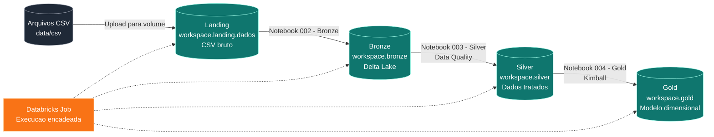

# Lakehouse com Databricks Free Edition e Arquitetura Medalhao

Projeto desenvolvido para a disciplina de Engenharia de Dados, com o objetivo de construir um pipeline Lakehouse no Databricks Free Edition utilizando a Arquitetura Medalhão.

O fluxo implementado parte de arquivos CSV de uma base relacional de seguros, carrega os dados em uma camada Landing, converte os dados para Delta Lake na Bronze, aplica regras de qualidade na Silver e disponibiliza tabelas dimensionais e fato na Gold.

[Documentacao completa](docs/index.md)

## Objetivo do Trabalho

Construir um pipeline de dados no Databricks seguindo as etapas:

1. Extrair dados de todas as tabelas de uma base relacional.
2. Armazenar os arquivos brutos no schema `landing`, dentro do volume `dados`.
3. Ler os arquivos CSV da Landing e gravar tabelas Delta no schema `bronze`.
4. Ler a Bronze, aplicar tratamentos e regras de qualidade, e gravar no schema `silver`.
5. Ler a Silver e criar uma camada dimensional no schema `gold`, seguindo os conceitos de Ralph Kimball.
6. Encadear todos os notebooks em uma Job no Databricks.

## Arquitetura



## Base de Dados

A base representa um contexto de seguros de automoveis. Os arquivos CSV utilizados estao em `data/csv/`.

| Arquivo | Registros | Descricao |
| --- | ---: | --- |
| `cliente.csv` | 20.010 | Clientes segurados |
| `telefone.csv` | 20.010 | Telefones dos clientes |
| `endereco.csv` | 20.010 | Enderecos dos clientes |
| `apolice.csv` | 10.000 | Apolices contratadas |
| `carro.csv` | 10.002 | Veiculos segurados |
| `sinistro.csv` | 10.000 | Ocorrencias de sinistro |
| `marca.csv` | 10 | Marcas dos veiculos |
| `modelo.csv` | 100 | Modelos dos veiculos |
| `municipio.csv` | 5.570 | Municipios brasileiros |
| `estado.csv` | 27 | Estados brasileiros |
| `regiao.csv` | 5 | Regioes brasileiras |

## Notebooks

Os notebooks foram exportados do Databricks em formato `.dbc` e estao em `notebooks/dbc/`. Tambem foi mantida uma versao extraida em `notebooks/python/` para facilitar a leitura do conteudo pelo GitHub.

| Ordem | Notebook | Finalidade |
| ---: | --- | --- |
| 1 | `001 - Preparando ambiente` | Cria schemas e volume do projeto |
| 2 | `002 - Bronze` | Le CSVs da Landing e cria tabelas Delta na Bronze |
| 3 | `003 - Silver` | Aplica tratamentos e Data Quality |
| 4 | `004 - Gold` | Cria dimensoes e fato no modelo dimensional |
| 5 | `005 - Destruindo ambiente` | Remove objetos criados, quando necessario |

## Execucao no Databricks

1. Acesse o Databricks Free Edition.
2. Importe os arquivos `.dbc` da pasta `notebooks/dbc/`.
3. Envie os CSVs da pasta `data/csv/` para o volume `workspace.landing.dados`.
4. Execute os notebooks na ordem numerica.
5. Crie uma Job com as tarefas encadeadas:
   - `001 - Preparando ambiente`
   - `002 - Bronze`
   - `003 - Silver`
   - `004 - Gold`
6. Execute a Job e valide a criacao das tabelas nos schemas `bronze`, `silver` e `gold`.

O notebook `005 - Destruindo ambiente` deve ser usado apenas para limpeza do ambiente, quando for necessario reiniciar o projeto.

## Camadas do Lakehouse

### Landing

Camada de entrada dos dados. Armazena os arquivos CSV originais dentro de um volume do Databricks, mantendo os dados brutos sem transformacoes.

### Bronze

Camada Delta criada a partir dos arquivos da Landing. Mantem uma representacao estruturada dos dados de origem, com rastreabilidade para o arquivo processado e metadados de carga.

### Silver

Camada de dados tratados. Nesta etapa sao aplicadas regras de qualidade, padronizacao de campos, conversao de tipos e ajustes necessarios para consumo analitico.

### Gold

Camada dimensional, voltada para analise. O modelo segue a abordagem de Ralph Kimball, separando dimensoes descritivas e tabela fato para perguntas de negocio.

## Estrutura do Projeto

```text
.
├── data/
│   └── csv/
│       ├── apolice.csv
│       ├── carro.csv
│       ├── cliente.csv
│       ├── endereco.csv
│       ├── estado.csv
│       ├── marca.csv
│       ├── modelo.csv
│       ├── municipio.csv
│       ├── regiao.csv
│       ├── sinistro.csv
│       └── telefone.csv
├── docs/
│   ├── index.md
│   ├── arquitetura.md
│   ├── dados.md
│   ├── execucao.md
│   ├── gold.md
│   ├── job.md
│   └── notebooks/
│       ├── 001_preparando_ambiente.md
│       ├── 002_bronze.md
│       ├── 003_silver.md
│       ├── 004_gold.md
│       └── 005_destruindo_ambiente.md
├── notebooks/
│   ├── dbc/
│   └── python/
├── mkdocs.yml
├── requirements.txt
└── README.md
```

## Tecnologias Utilizadas

- Databricks Free Edition
- Apache Spark
- PySpark
- Spark SQL
- Delta Lake
- Unity Catalog
- Databricks Volumes
- Databricks Jobs
- GitHub
- MkDocs

## Conceitos Demonstrados

- Lakehouse
- Arquitetura Medalhao
- Ingestao de arquivos CSV
- Armazenamento em Delta Lake
- Data Quality
- Modelagem dimensional
- Dimensoes e fatos
- Encadeamento de notebooks com Databricks Jobs
- Organizacao de projeto de Engenharia de Dados

## Referencia

Este repositorio foi organizado tomando como referencia estrutural o projeto do Trabalho 2: <https://github.com/Xandetds/Apache-Spark-com-MINIO-e-SQL>.
