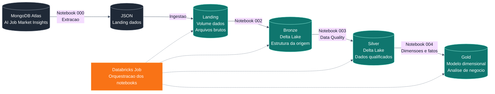

# Arquitetura

O projeto segue a Arquitetura Medalhao, uma abordagem comum em Lakehouse para organizar dados por nivel de refinamento.

## Visao Geral

## Landing

A Landing e a camada de entrada. Nela ficam os arquivos JSON exatamente como recebidos do MongoDB Atlas.

No Databricks, essa camada foi representada pelo schema `workspace.landing` e pelo volume `workspace.landing.dados`.

Responsabilidades:

- armazenar os arquivos brutos;
- preservar a origem dos dados;
- servir como ponto inicial de reprocessamento.

## Bronze

A Bronze transforma os arquivos JSON em tabelas Delta.

Responsabilidades:

- ler os arquivos da Landing;
- criar tabelas Delta;
- manter a granularidade original;
- adicionar metadados de processamento quando necessario.

Essa camada ainda esta proxima da fonte, com pouca regra de negocio aplicada.

## Silver

A Silver e a camada de dados tratados.

Responsabilidades:

- padronizar nomes e formatos;
- corrigir tipos de dados;
- remover ou tratar inconsistencias;
- aplicar regras de qualidade;
- preparar dados para modelagem dimensional.

## Gold

A Gold e a camada de consumo analitico.

Responsabilidades:

- disponibilizar dimensoes;
- disponibilizar tabela fato;
- reduzir complexidade para consultas;
- apoiar analises de cargos, setores, salarios, habilidades, localizacao, trabalho remoto, risco de automacao e crescimento do mercado.

O desenho segue a abordagem dimensional de Ralph Kimball, separando entidades descritivas em dimensoes e eventos/medidas em fatos.
